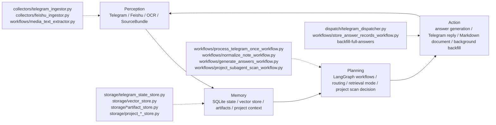

# XHS Interview Answer Copilot

This is an implementation for demonstrating core AI Agent concepts: using an interview-answer assistant scenario to show RAG, workflow orchestration, multi-source perception, and asynchronous execution.

The repository name remains `xhs-auto-generate-answer`, but the project should be read primarily as an AI Agent engineering demo. It uses Telegram and local artifacts as the user-facing shell, while the underlying design maps common agent concepts to concrete modules.

## Core Agent Loop



- **Perception**: Ingests user-provided interview content from Telegram or Feishu, extracts text from screenshots, and normalizes all sources into `SourceBundle`.
- **Memory**: Persists bot state, normalized artifacts, generated answers, vector records, project context, deep scan caches, and project-specific answer memory.
- **Planning**: Uses LangGraph workflows to decide how to normalize, retrieve, route project-specific questions, invoke runtime project scanning, and choose answer strategy.
- **Action**: Generates interview-ready answers, replies to Telegram quickly, stores reusable records, and runs slower full-answer backfill asynchronously.

## Planned stack

- Python
- Playwright
- LangGraph
- Pydantic
- SQLite
- Telegram Bot API

## Current status

- PRD drafted in `docs/PRD.md`
- Ralph execution plan drafted in `scripts/ralph/prd.json`

## Package layout

- `src/xhs_interview_answer_copilot/collectors`
- `src/xhs_interview_answer_copilot/workflows`
- `src/xhs_interview_answer_copilot/storage`
- `src/xhs_interview_answer_copilot/dispatch`

## Configuration

Bootstrap-stage environment variables:

- `XHS_BASE_URL`
- `XHS_BROWSER_MODE`
- `XHS_CDP_URL`
- `XHS_PROFILE_DIR`
- `XHS_FAVORITES_URL`
- `XHS_FAVORITES_FOLDER_NAME`
- `XHS_AUTHENTICATED_SELECTOR`
- `XHS_NOTE_LINK_SELECTOR`
- `XHS_LOGIN_TIMEOUT_SECONDS`
- `OUTPUT_DIR`
- `OPENAI_API_KEY`
- `OPENAI_BASE_URL`
- `OPENAI_PROXY_URL`
- `OPENAI_TIMEOUT_SECONDS`
- `NORMALIZE_MODEL`
- `VISION_MODEL`
- `EMBEDDING_MODEL`
- `ANSWER_MODEL`
- `PROJECT_SCAN_MODEL`
- `PROJECT_SCAN_PROVIDER`
- `RETRIEVAL_MODE`
- `RETRIEVAL_TOP_K`
- `RETRIEVAL_MIN_SCORE`
- `TELEGRAM_BOT_TOKEN`
- `TELEGRAM_CHAT_ID`
- `TELEGRAM_API_BASE`
- `TELEGRAM_PROXY_URL`
- `SQLITE_PATH`

## Run

After installing the package in editable mode, run:

- `xhs-copilot status`
- `xhs-copilot project use <path>`
- `xhs-copilot project current`
- `xhs-copilot project refresh`
- `xhs-copilot project clear`
- `xhs-copilot login`
- `xhs-copilot healthcheck`
- `xhs-copilot discover`
- `xhs-copilot extract-note <note_id>`
- `xhs-copilot normalize-note <note_id>`
- `xhs-copilot index-note <note_id>`
- `xhs-copilot search-similar <query>`
- `xhs-copilot react-agent-demo <question>`
- `xhs-copilot eval-retrieval <dataset.json>`
- `xhs-copilot generate-answers <note_id>`
- `xhs-copilot generate-answers <note_id> --quick`
- `xhs-copilot backfill-full-answers <note_id>`
- `xhs-copilot store-answer-records <note_id>`
- `xhs-copilot reply-telegram <note_id>`
- `xhs-copilot process-telegram-once`
- `xhs-copilot process-telegram-daemon --interval-seconds 15`
- `xhs-copilot telegram-worker-start`
- `xhs-copilot telegram-worker-status`
- `xhs-copilot telegram-worker-stop`
- `xhs-copilot ingest-feishu-event <json_path>`
- `xhs-copilot ingest-telegram-once`
- or `python -m xhs_interview_answer_copilot.main status`

## Playwright setup

Install Python dependencies and browser binaries before using login commands:

- `pip install -e .`
- `playwright install chromium`

`XHS_AUTHENTICATED_SELECTOR` is optional but strongly recommended. If you set it to a selector that is only visible after login, `xhs-copilot login` can wait for it during bootstrap and `xhs-copilot healthcheck` can verify the saved session more reliably. Without it, the login command falls back to manual confirmation and health checks return conservative results when they cannot prove the session is still authenticated.

For a lower-risk setup, set `XHS_BROWSER_MODE=cdp`, launch your own Chrome with `--remote-debugging-port=9222`, keep your normal Xiaohongshu session logged in there, and set `XHS_CDP_URL=http://127.0.0.1:9222`.

`XHS_FAVORITES_URL` should point to the exact favorites page you want to scan. `XHS_NOTE_LINK_SELECTOR` defaults to `a` for a minimal MVP and can be narrowed later if the page contains too many unrelated links.

`xhs-copilot extract-note <note_id>` looks up the note URL from the local discovery database and writes a per-note `raw.json` under `OUTPUT_DIR`.

`xhs-copilot normalize-note <note_id>` is the first LangGraph-based step. It loads `raw.json` from either a web note bundle or a Telegram bundle, calls an LLM through LangChain structured output, and writes `normalized.json` under `OUTPUT_DIR`.

`xhs-copilot index-note <note_id>` embeds the normalized questions and stores them in a local SQLite-backed vector table. `xhs-copilot search-similar <query>` runs retrieval over those indexed questions using the current retrieval mode.

`RETRIEVAL_MODE` supports `vector`, `bm25`, and `hybrid`. `vector` uses embeddings, `bm25` uses local text scoring over the indexed question corpus, and `hybrid` merges both rankings. The active default mode can also be changed from Telegram by sending a message that is exactly `[vector]`, `[bm25]`, or `[hybrid]`.

`xhs-copilot react-agent-demo <question>` is a minimal LangGraph ReAct loop for demonstrating Planning and Tool Use. Instead of following the fixed production DAG, the demo agent runs a small `decide -> tool -> decide -> final answer` loop and can choose between two tools: `search_knowledge` (the existing retrieval layer) and `answer_question` (LLM answer generation). A typical run looks like:

```bash
xhs-copilot react-agent-demo "当前项目的 RAG 检索为什么要支持 hybrid？"
```

Example CLI output:

```text
success=True
reason=ReAct agent demo completed.
steps_json=[{"thought":"Need supporting knowledge before answering.","action":"search_knowledge","action_input":"当前项目的 RAG 检索为什么要支持 hybrid？"},{"tool":"search_knowledge","input":"当前项目的 RAG 检索为什么要支持 hybrid？","observation":"..."},{"thought":"Knowledge has been gathered; answer the question now.","action":"answer_question","action_input":"当前项目的 RAG 检索为什么要支持 hybrid？"},{"tool":"answer_question","input":"当前项目的 RAG 检索为什么要支持 hybrid？","observation":"..."}]
final_answer=Explain the general retrieval tradeoff first, then use this project as a concise example.
```

This shows the interview-facing Agent capability: the LLM-backed loop can decide to search first and answer second, rather than only executing a hard-coded normalize → retrieve → generate pipeline. It is intentionally a small and safe ReAct demo, not a fully open-ended autonomous agent.

Project-aware answering is backend-only in the first implementation and does not require a frontend. Use `xhs-copilot project use <path>` to set the active repository, `xhs-copilot project current` to inspect it, `xhs-copilot project refresh` to rebuild the cached structured summary under `OUTPUT_DIR/project-context/`, and `xhs-copilot project clear` to remove the current selection. Project-specific interview questions such as asking how the current project implements memory, retrieval, orchestration, or background workers will inject that cached project context into answer generation when the question explicitly refers to the current project.

When a project question needs more implementation detail, the answer workflow now runs a deeper topic-specific repository scan for areas such as `retrieval`, `memory`, `worker`, `storage`, or `architecture`. The runtime scan provider is controlled by `PROJECT_SCAN_PROVIDER`: `auto` tries the dedicated runtime subagent-style scanner first and falls back to the local scanner, `subagent` prefers the subagent path but still falls back locally on failure, and `local` disables the runtime subagent path. `PROJECT_SCAN_MODEL` controls which model powers the runtime scanner when the subagent path is used. Deep scan results are cached per project path, topic, repository fingerprint, provider, and optional question hash under `OUTPUT_DIR/project-context/`, so similar future questions can reuse the deeper context without rescanning unchanged code. Project-specific final answers are also appended to a local `answer_memory.jsonl` file in the same cache directory and are reused on later questions with the same project fingerprint.

`xhs-copilot eval-retrieval <dataset.json>` runs a fixed retrieval benchmark across `vector`, `bm25`, and `hybrid` modes, scores each mode with Recall@K, MRR, Hit@1, keyword coverage, and average latency, and writes JSON/Markdown reports under `OUTPUT_DIR/evals/`.

`xhs-copilot generate-answers <note_id>` is the first end-to-end RAG answer step. It loads `normalized.json`, retrieves similar indexed questions, and writes `answers.json` under `OUTPUT_DIR`.

`xhs-copilot store-answer-records <note_id>` stores generated question-answer records in local vector storage so later retrieval and archival flows can reuse both questions and answers.

`xhs-copilot reply-telegram <note_id>` sends a concise text reply built from the generated answers back to the configured Telegram chat.

`xhs-copilot process-telegram-once` is the LangGraph-based one-shot orchestration command. It ingests Telegram once, then automatically runs normalization, question indexing, answer generation, Markdown archival, question-answer vector storage, and Telegram reply for each new bundle.

Telegram orchestration now sends progress messages while it OCRs, normalizes, indexes, generates, stores, and replies, so large image notes do not look stuck. It sends a quick local answer first so image notes can be acknowledged quickly. A non-blocking `backfill-full-answers` process is started after the Telegram reply to regenerate full LLM answers, refresh stored answer records when possible, and send the completed `answer.md` file back to Telegram as a document.

The Telegram worker also supports explicit control commands. Send `[project:/absolute/or/relative/path]` to switch the active project and rebuild its cached context, or `[project-refresh]` to refresh the cached summary for the current active project. These commands are handled conservatively like retrieval-mode switches and do not require a separate frontend.

`xhs-copilot process-telegram-daemon` runs the same Telegram pipeline in a loop so the project can behave like a resident local worker. Use `--interval-seconds` to control the normal polling cadence, `--failure-backoff-seconds` to slow down after failures such as provider rate limits, and `--max-loops` for local testing.

For a practical background worker, run `xhs-copilot telegram-worker-start`. It starts `process-telegram-daemon` inside a detached tmux session named `xhs-copilot-telegram`, appends logs to `telegram-daemon.log` next to `SQLITE_PATH` (default `data/telegram-daemon.log`), and avoids launching a duplicate worker if the session already exists. Use `xhs-copilot telegram-worker-status` to check whether it is running, `tmux attach -t xhs-copilot-telegram` to inspect it interactively, and `xhs-copilot telegram-worker-stop` to stop it.

`xhs-copilot ingest-feishu-event <json_path>` ingests a Feishu event payload file, maps supported text-message events into the shared `SourceBundle` schema, and stores the resulting raw bundle locally.

`xhs-copilot ingest-telegram-once` fetches Telegram updates once, downloads any attached photo or document from allowed chats, and writes a raw bundle under `OUTPUT_DIR/telegram_<update_id>/raw.json`.

Raw ingestion now trends toward a shared `SourceBundle` shape with explicit `canonical_url`, `text_blocks`, `asset_paths`, and `image_urls`, so Telegram is the first message-driven source and later integrations such as Feishu can target the same normalization entry point.

If `api.telegram.org` is blocked in your network, set `TELEGRAM_PROXY_URL` to an HTTP or HTTPS proxy address such as `http://127.0.0.1:7890`.

If model requests need the same proxy, set `OPENAI_PROXY_URL` such as `http://127.0.0.1:7890`. You can also adjust `OPENAI_TIMEOUT_SECONDS` for slower model responses.

For quick local testing when your endpoint does not provide embeddings, set `EMBEDDING_MODEL=local-hash-v1` to use a deterministic local hash embedding fallback.

If your endpoint supports multimodal input, set `VISION_MODEL` to a compatible model name so screenshot assets can be converted into text during normalization.
